# Esteira-Seletora-Por-Cores

TCC em Automação industrial pelo ITJ (Instituto de Tecnologia de Jacareí)

## Membros

- Alexsander da Silva Santos;
- Carlos Augusto dos Santos Neto;
- Felipi Augusto Lopes;
- Nicolas Renalto Martins.

## Resumo

Atualmente as esteiras são aplicadas em diversos ramos, tendo como objetivo a facilitação e a aceleração do transporte dos mais variados tipos de objetos. Nosso projeto é a Esteira seletora por cores, na qual irá separar um objeto a partir de sua cor (as cores usadas serão, Vermelha, Verde e Azul), direcionando para um determinado recipiente com o auxílio de um servo motor.     
Este projeto com as devidas modificações poderá ser utilizado em industrias, por exemplo na parte de encaminhamento do produto para sua respectiva embalagem.

## Tecnologias Utilizadas

* ARDUINO UNO 
* SENSOR RGB (DATASHEET TC3200)
* MOTOR DC (PARA-BRISA)
* MÓDULO RELÉ 
* DISPLAY LCD 
* SERVO MOTOR (MG996R) 
* LASER 
* SENSOR LDR (LIGHT DEPENDENT RESISTOR).

## Fluxograma de processo

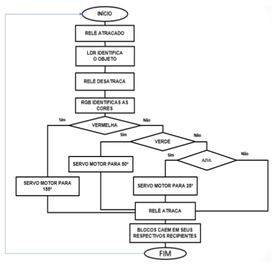

## Distribuição Lógica

### Esquema lógico
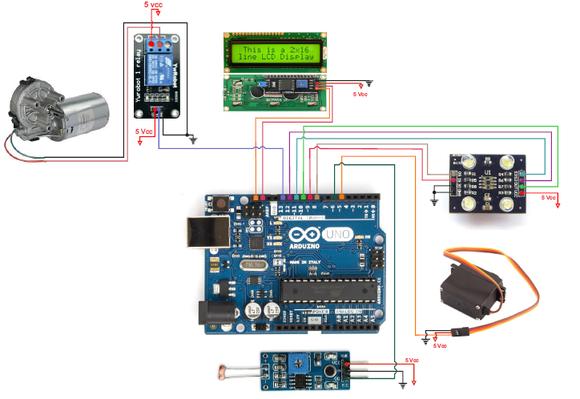

## Imagens

### Projeto
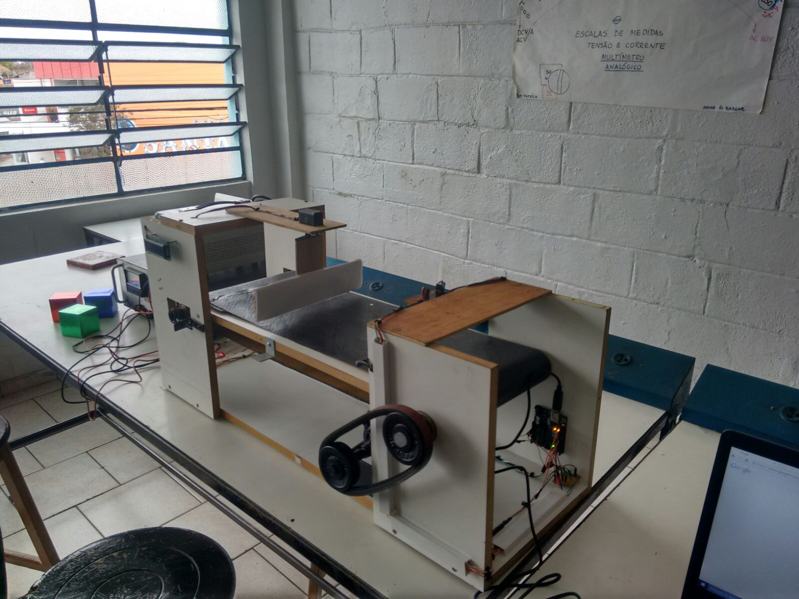

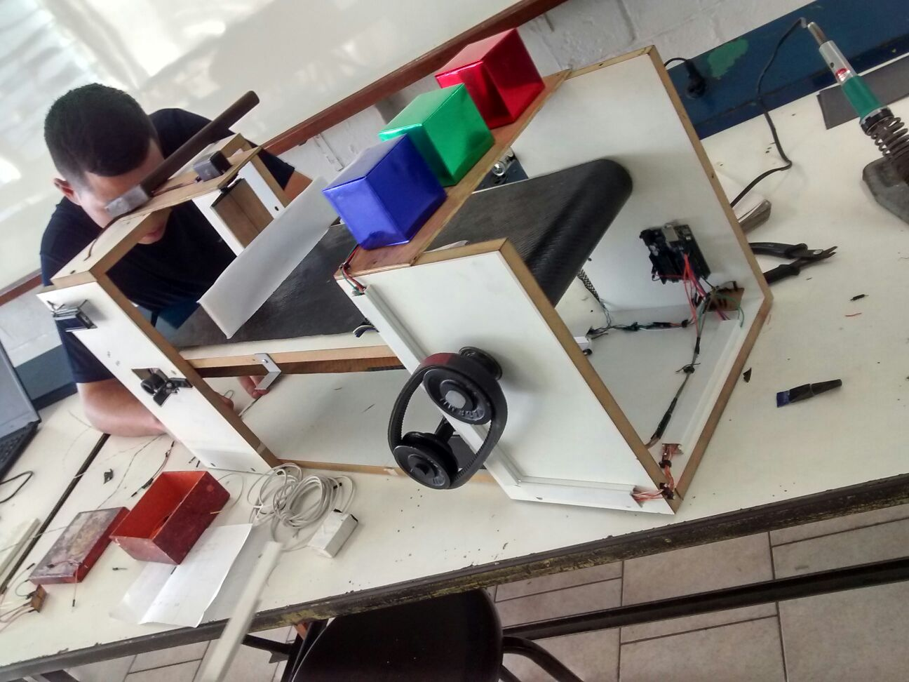

### Detecção Objeto Azul
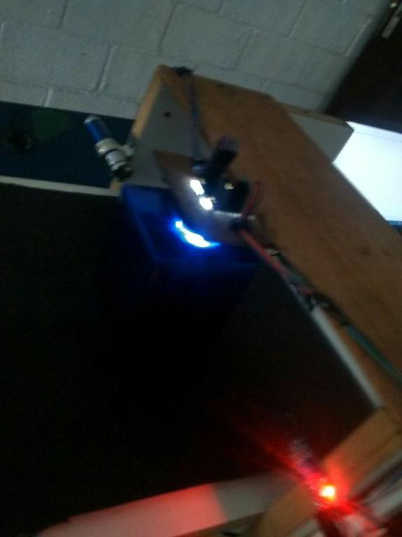

### Detecção Objeto Vermelho
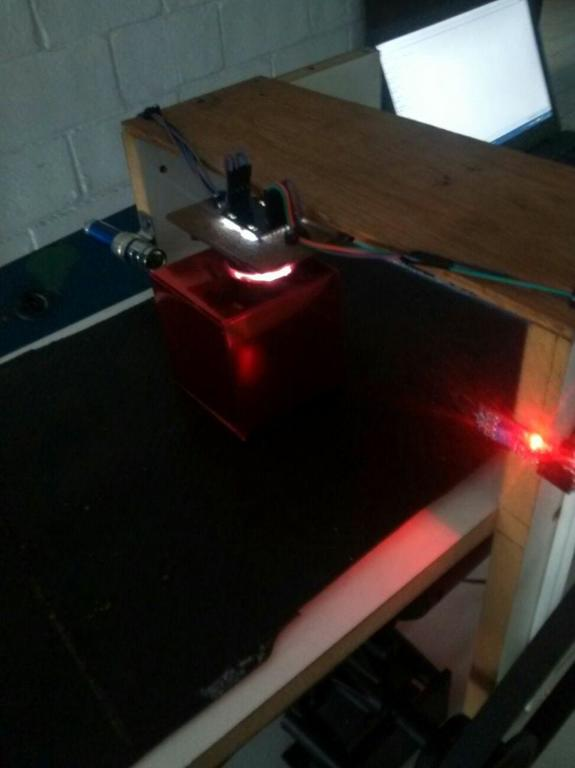

### Detecção Objeto Verde
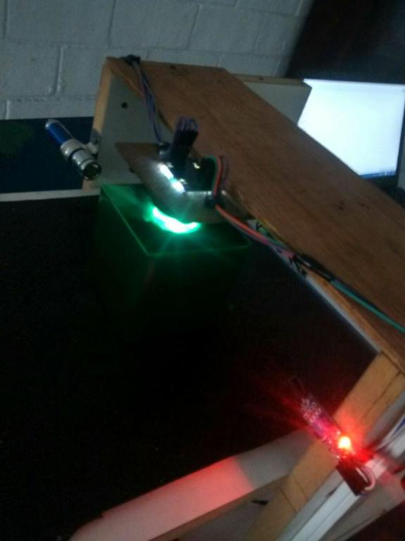

## Projeção
Imagens feitas no software de projeção autocad.

### Frontal
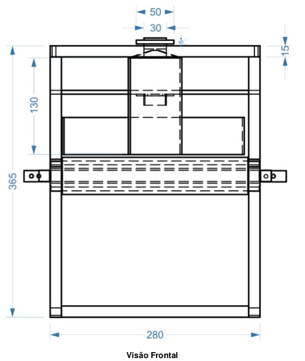

### Isometrica Pontilhada
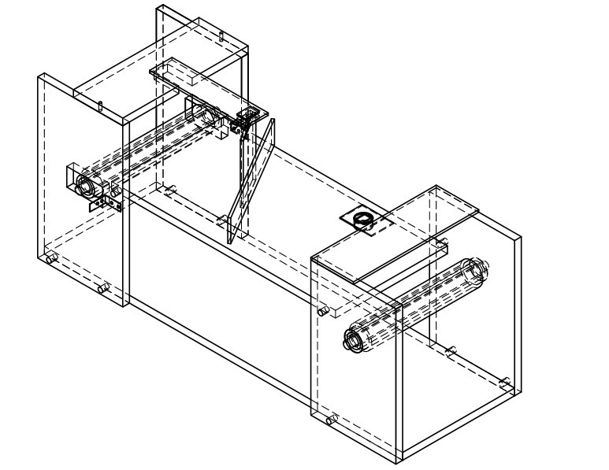

### Lateral Pontilhada
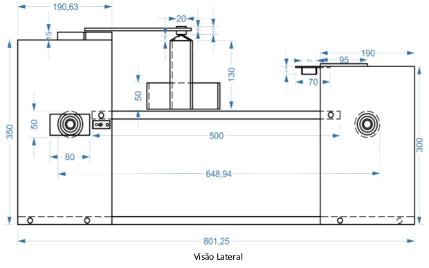

### Planta Pontilhada
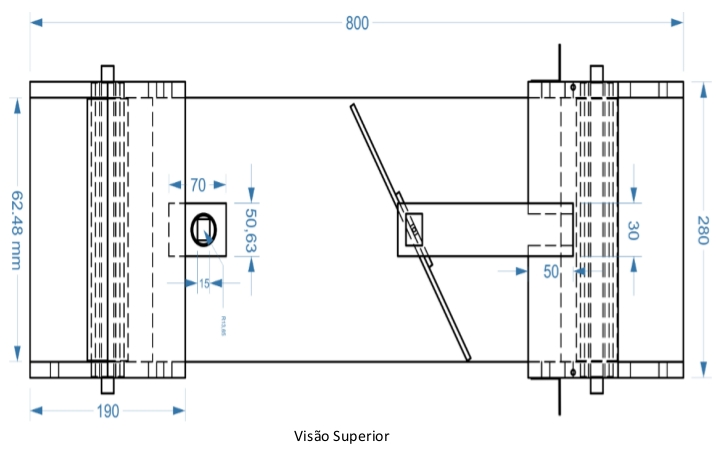

### Isométrica Sólido
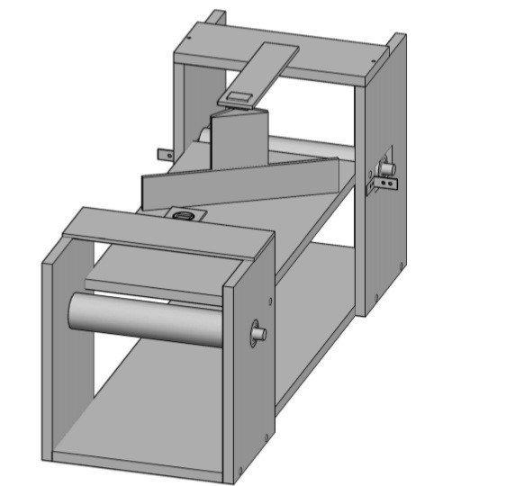
